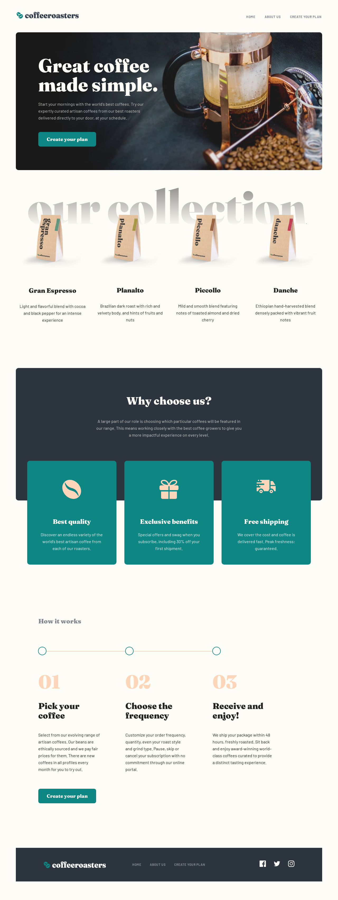
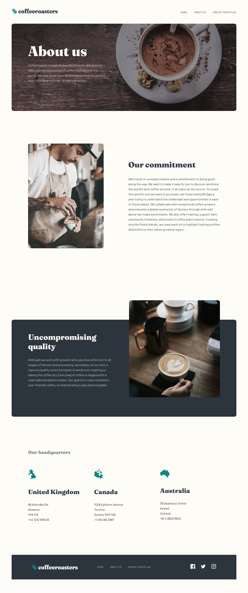
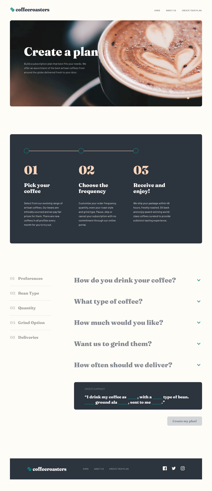

# Coffee Roasters

A Frontend Mentor project to build a responsive Coffee Roasters website using ReactJS and Material-UI.

## Table of Contents

- [Overview](#overview)
- [Links](#links)
- [Features](#features)
- [Technologies Used](#technologies-used)
- [Installation](#installation)
- [Usage](#usage)
- [Screenshots](#screenshots)

## Links

- Live Site URL: [https://bmi-calculator-fadi.vercel.app/](https://coffee-roasters-fadi.vercel.app/)

## Overview

Coffee Roasters is a responsive website built with ReactJS for managing different coffee products and information. This project demonstrates modern web development practices such as responsive design, image caching, and efficient routing.

## Features

- Responsive design with breakpoints
- Image caching for improved performance
- Consistent layout with a common padding for components
- Smooth navigation using React Router
- Usage of React hooks like `useEffect`, `useRef`, `useState`, and `useMemo`

## Technologies Used

- ReactJS
- Material-UI (MUI)
- React Router DOM
- JavaScript (ES6+)
- CSS for custom styling
- JSON files for storing data

## Installation

1. Clone the repository:
   ```sh
   git clone https://github.com/fadialjawhary0/coffee-roasters
2. Navigate to the project directory:
   ```sh
   cd coffee-roasters
3. Install the dependencies:
   ```sh
   npm install

## Usage

1. Start the development server:
   ```sh
   npm start
2. Open your browser and go to http://localhost:3000 to view the website.

## Screenshots

Home page:


About us page:


Plan page:



